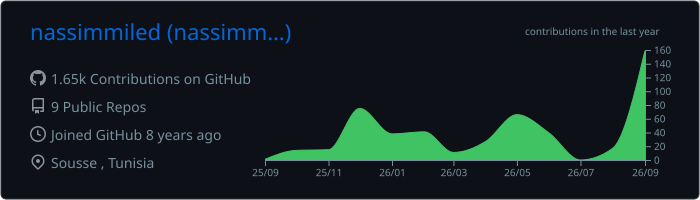
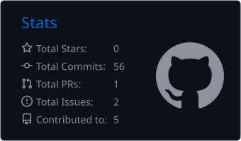
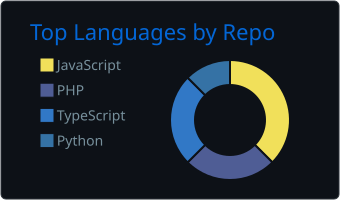

  
  

### 🚀 About me

**Full-stack developer and indie SaaS builder.** I build products end to end, from the API and the database to the dashboard and the marketing site.

- 🧱 Most of my time goes into **TypeScript**: React on the front, Node and Fastify on the back
- 🤖 I build AI features that do real work, not demos
- 📱 I've shipped mobile apps with **React Native**
- 🐘 My roots are in **PHP / Laravel**

### 🛠️ Tech stack

   
  

### 📊 GitHub stats

  

  
  

  

<picture>
  <source media="(prefers-color-scheme: dark)" srcset="https://raw.githubusercontent.com/nassimmiled/nassimmiled/output/github-snake-dark.svg" />
  
</picture>

### 🤝 Say hi

Open to freelance work and interesting collaborations.

